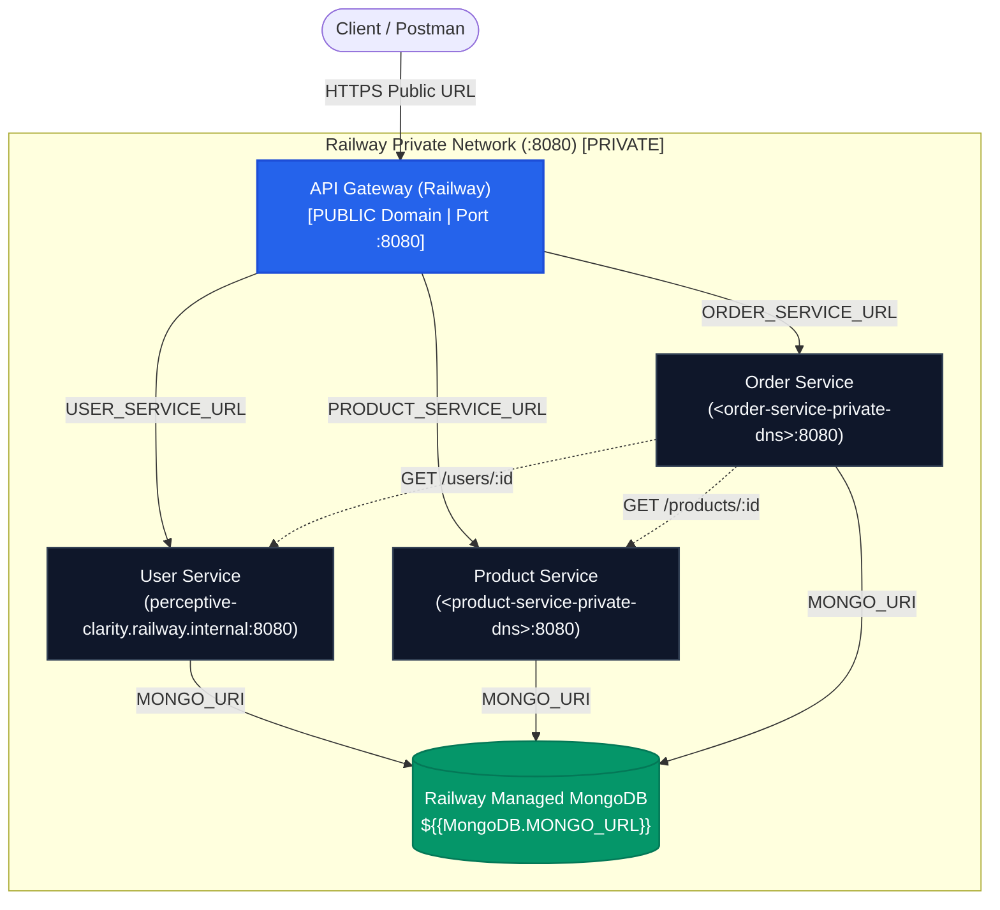
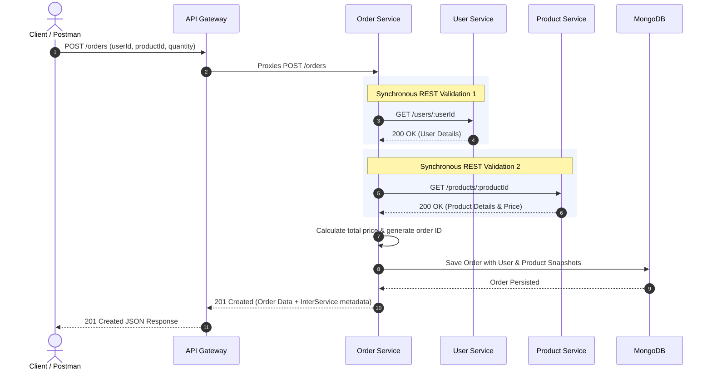

# Campus Connect – WSSOA Lab 7

## API Gateway, Configuration-Based Service Discovery & Railway Cloud Deployment

**Campus Connect** is a distributed microservices platform built for academic campus operations as part of the **Web Services & Service-Oriented Architecture (WSSOA)** laboratory curriculum. 

In **Lab 6**, the monolithic backend was decomposed into three independent microservices (**User Service**, **Product Service**, and **Order Service**) utilizing a *Database-per-Service* architecture communicating over an internal Docker network. However, direct access to individual service ports was required from clients, and the API Gateway existed only as an architectural concept.

**Lab 7** brings this architecture to production maturity by implementing a dedicated Node.js/Express **API Gateway** as the single external entry point, decoupling service locations via **Configuration-Based Service Discovery**, enforcing strict container perimeter isolation, and deploying the entire distributed system to **Railway Cloud** with private mesh networking and a managed MongoDB database.

---

## 1. Project Overview

The evolution from Lab 6 to Lab 7 introduces key enterprise patterns to solve distributed system challenges:

- **Single Entry Point**: Clients interact exclusively with the API Gateway (`localhost:3000` locally, or the public HTTPS gateway URL in the cloud) rather than managing multiple microservice hostnames and ports.
- **Decoupled Service Locations**: Downstream service addresses are externalized into environment variables (`USER_SERVICE_URL`, `PRODUCT_SERVICE_URL`, `ORDER_SERVICE_URL`). Route-handling logic contains zero hard-coded URLs.
- **Cross-Cutting Concerns**: Request logging, system-wide health status reporting, and centralized fault interception are handled uniformly at the gateway layer.
- **Perimeter Defense**: In local Docker Compose, host port exposure is restricted solely to the API Gateway (`3000:3000`). Microservices and database engines run entirely inside an internal bridge network (`campus-network`).
- **Cloud-Native Deployment**: The microservices and MongoDB database are deployed on **Railway**, establishing private service-to-service communication on internal port `8080` while exposing only the API Gateway to the public internet.

---

## 2. Lab 7 Objectives

- **API Gateway Implementation**: Build a reverse proxy in Node.js/Express with path preservation and payload streaming for `/users/*`, `/products/*`, and `/orders/*`.
- **Configuration-Based Service Discovery**: Inject dynamic downstream URLs into the gateway at runtime without modifying routing source code.
- **Centralized Request Logging**: Record every inbound request method, URI path, destination service, and response status code.
- **Centralized Error Handling**: Intercept socket drops and unreachable downstream services to return standardized `502 Bad Gateway` responses.
- **Docker Network Isolation**: Confine backend microservices and databases inside `campus-network` with zero direct host port exposure.
- **Railway Cloud Deployment**: Deploy all 4 application services and a managed MongoDB instance to Railway with private internal DNS communication.
- **Inter-Service Communication**: Verify synchronous REST validation where Order Service calls User Service and Product Service before creating orders.
- **Postman Test Verification**: Execute end-to-end CRUD and inter-service verification test suites through the public API Gateway.

---

## 3. System Architecture

### 3.1 Local Docker Architecture

In local development orchestrated by `compose.yaml`, all 7 containers run on the private bridge network `campus-network`. Only `api-gateway` binds port `3000` to the host machine.

```mermaid
graph TD
    Client(["Client / Postman / Web App"]) -->|HTTP :3000 (Exposed Host Port)| GW["API Gateway<br/>(Port :3000)"]

    subgraph Docker_Bridge_Network ["Docker Network: campus-network (Internal / Unexposed)"]
        GW -->|USER_SERVICE_URL| US["user-service<br/>(Container Port :3001)"]
        GW -->|PRODUCT_SERVICE_URL| PS["product-service<br/>(Container Port :3002)"]
        GW -->|ORDER_SERVICE_URL| OS["order-service<br/>(Container Port :3003)"]

        OS -.->|GET http://user-service:3001/users/:id| US
        OS -.->|GET http://product-service:3002/products/:id| PS

        US -->|MONGO_URI| M1[("mongo-user<br/>(user_db :27017)")]
        PS -->|MONGO_URI| M2[("mongo-product<br/>(product_db :27017)")]
        OS -->|MONGO_URI| M3[("mongo-order<br/>(order_db :27017)")]
    end

    classDef public fill:#2563eb,stroke:#1d4ed8,stroke-width:2px,color:#fff;
    classDef private fill:#0f172a,stroke:#334155,stroke-width:1.5px,color:#f8fafc;
    classDef db fill:#059669,stroke:#047857,stroke-width:1.5px,color:#fff;

    class GW public;
    class US,PS,OS private;
    class M1,M2,M3 db;
```

### 3.2 Railway Cloud Architecture

In production on **Railway**, all microservices and the API Gateway listen on internal container port `PORT=8080`. Microservices communicate over Railway's private DNS network. Only the API Gateway is assigned a public HTTPS domain.



---

## 4. API Gateway

The API Gateway (`api-gateway/server.js`) acts as the single entry point and reverse proxy for all client requests using `http-proxy-middleware`.

### 4.1 Responsibilities
- **Single Entry Point**: Consolidates all microservice APIs under a unified root URL.
- **Reverse Proxy Routing**: Forwards requests based on route prefixes (`/users`, `/products`, `/orders`) while preserving path suffixes, URL parameters, and query strings.
- **Request Body Streaming**: Automatically ensures parsed JSON payloads for `POST` and `PUT` requests are forwarded downstream.
- **Centralized Request Logging**: Intercepts and logs every inbound request, proxy target, and completion status.
- **Health Reporting**: Exposes `GET /health` detailing gateway operational status and current discovery routing table.
- **Fault Interception**: Catches downstream socket failures (`ECONNREFUSED`, `ETIMEDOUT`) and returns structured `502 Bad Gateway` error responses.

### 4.2 Routing Table

| Route | Target Microservice | Environment Variable | Local Target | Railway Cloud Target |
| :--- | :--- | :--- | :--- | :--- |
| `GET /health` | API Gateway | *Handled Directly* | `http://localhost:3000/health` | `https://<RAILWAY_GATEWAY_URL>/health` |
| `/users/*` | User Service | `USER_SERVICE_URL` | `http://user-service:3001` | `http://perceptive-clarity.railway.internal:8080` |
| `/products/*` | Product Service | `PRODUCT_SERVICE_URL` | `http://product-service:3002` | `http://<product-service-private-dns>:8080` |
| `/orders/*` | Order Service | `ORDER_SERVICE_URL` | `http://order-service:3003` | `http://<order-service-private-dns>:8080` |

### 4.3 Health Endpoint

The `GET /health` endpoint verifies gateway liveness and outputs the active routing configuration table:

```json
{
  "status": "UP",
  "service": "api-gateway",
  "timestamp": "2026-09-29T09:15:00.000Z",
  "port": 3000,
  "serviceDiscovery": {
    "mode": "configuration-based",
    "routingTable": {
      "/users": "http://user-service:3001",
      "/products": "http://product-service:3002",
      "/orders": "http://order-service:3003"
    }
  }
}
```

> **Production Security Note**: In this laboratory demonstration, exposing internal infrastructure addresses in `/health` illustrates service discovery in action. In hardened production systems, internal network addresses should typically be omitted from public health endpoints to prevent network topology disclosure.

### 4.4 Request Logging

The Gateway logs all inbound traffic and proxy forwarding events to `stdout`:
```
[API-GATEWAY LOG] 2026-09-29T09:15:32.100Z | GET /users
[API-GATEWAY PROXY] Forwarding GET /users -> http://user-service:3001/users
[API-GATEWAY RESPONSE] User Service [Status: 200] for GET /users
[API-GATEWAY LOG] 2026-09-29T09:16:10.012Z | POST /orders
[API-GATEWAY PROXY] Forwarding POST /orders -> http://order-service:3003/orders
[API-GATEWAY RESPONSE] Order Service [Status: 201] for POST /orders
```

### 4.5 Error Handling

If a downstream service is down or unreachable, the gateway traps the error event and returns a standardized JSON `502 Bad Gateway` response:

```json
{
  "success": false,
  "error": "Bad Gateway",
  "message": "Target microservice 'User Service' is unreachable or unavailable.",
  "targetService": "http://user-service:3001",
  "serviceName": "User Service",
  "statusCode": 502,
  "timestamp": "2026-09-29T09:20:00.000Z"
}
```

---

## 5. Configuration-Based Service Discovery

In this project, service discovery is implemented via **Configuration-Based Service Discovery**.

```
                         Environment Variables (.env / Cloud Config)
                                              │
                      ┌───────────────────────┼───────────────────────┐
                      ▼                       ▼                       ▼
              USER_SERVICE_URL        PRODUCT_SERVICE_URL     ORDER_SERVICE_URL
                      │                       │                       │
                      └───────────────────────┼───────────────────────┘
                                              ▼
                                    API Gateway (Startup)
                                              │
                         ┌────────────────────┼────────────────────┐
                         ▼                    ▼                    ▼
                    Proxy /users         Proxy /products      Proxy /orders
```

### 5.1 How Routing Configuration Works
1. **Startup Validation**: At application launch, `api-gateway/server.js` verifies that `USER_SERVICE_URL`, `PRODUCT_SERVICE_URL`, and `ORDER_SERVICE_URL` are present and non-empty. If any variable is missing, the gateway logs a descriptive error and terminates (`process.exit(1)`).
2. **Dynamic Route Registration**: The gateway initializes reverse proxy middlewares with target URLs bound to these environment variables.
3. **Decoupled Architecture**: Route-handling functions contain **no hard-coded hostnames or IP addresses**.

---

## 6. Configuration Change Proof

To verify that downstream service locations can change without modifying routing source code:

1. **Initial State (Configuration A)**:
   ```env
   USER_SERVICE_URL=http://user-service:3001
   ```
   *Requests to `/users` route to `http://user-service:3001`.*

2. **Updated State (Configuration B)**:
   Modify the environment variable without touching `api-gateway/server.js`:
   ```env
   USER_SERVICE_URL=http://new-user-host:8080
   ```
3. **Restart API Gateway Container**:
   The gateway reads the updated environment configuration at startup.
   *Requests to `/users` now immediately forward to `http://new-user-host:8080`.*

---

## 7. Static / Configuration-Based vs. Dynamic Service Discovery

| Characteristic | Configuration-Based Service Discovery *(Lab 7)* | Dynamic Service Discovery *(e.g., Consul, Eureka, Kubernetes)* |
| :--- | :--- | :--- |
| **Mechanism** | Environment variables / config files loaded at startup | Centralized service registry with heartbeats & dynamic registration |
| **Infrastructure Overhead** | Zero extra infrastructure required | Requires dedicated registry cluster, sidecars, or agents |
| **Scaling & Autoscaling** | Requires container-level load balancer or config updates | Automatically detects and registers autoscaled ephemeral instances |
| **Failure Detection** | Static; requires manual update or container restart if IP changes | Automatic real-time deregistration of unhealthy instances |
| **Load Balancing** | Handled by upstream container platform / reverse proxy | Client-side or registry-aware round-robin load balancing |
| **Operational Complexity** | Low — ideal for containerized stacks, Railway, Docker | High — ideal for large-scale dynamic Kubernetes clusters |

---

## 8. Docker Compose

The `compose.yaml` file coordinates the multi-container stack on a shared private bridge network (`campus-network`).

### 8.1 Compose Specification (`compose.yaml`)

```yaml
services:
  api-gateway:
    build: ./api-gateway
    container_name: api-gateway
    ports:
      - "3000:3000" # ONLY API Gateway is exposed to the host
    environment:
      PORT: 3000
      USER_SERVICE_URL: http://user-service:3001
      PRODUCT_SERVICE_URL: http://product-service:3002
      ORDER_SERVICE_URL: http://order-service:3003
    depends_on:
      - user-service
      - product-service
      - order-service
    networks:
      - campus-network

  user-service:
    build: ./user-service
    container_name: user-service
    environment:
      PORT: 3001
      MONGO_URI: mongodb://mongo-user:27017/user_db
    depends_on:
      - mongo-user
    networks:
      - campus-network

  mongo-user:
    image: mongo
    container_name: mongo-user
    volumes:
      - user-mongo-data:/data/db
    networks:
      - campus-network

  product-service:
    build: ./product-service
    container_name: product-service
    environment:
      PORT: 3002
      MONGO_URI: mongodb://mongo-product:27017/product_db
    depends_on:
      - mongo-product
    networks:
      - campus-network

  mongo-product:
    image: mongo
    container_name: mongo-product
    volumes:
      - product-mongo-data:/data/db
    networks:
      - campus-network

  order-service:
    build: ./order-service
    container_name: order-service
    environment:
      PORT: 3003
      USER_SERVICE_URL: http://user-service:3001
      PRODUCT_SERVICE_URL: http://product-service:3002
      MONGO_URI: mongodb://mongo-order:27017/order_db
    depends_on:
      - mongo-order
      - user-service
      - product-service
    networks:
      - campus-network

  mongo-order:
    image: mongo
    container_name: mongo-order
    volumes:
      - order-mongo-data:/data/db
    networks:
      - campus-network

networks:
  campus-network:
    name: campus-network
    driver: bridge

volumes:
  user-mongo-data:
  product-mongo-data:
  order-mongo-data:
```

### 8.2 Port Exposure Table

| Service | Container Port | Host Port Mapping | Network Access |
| :--- | :--- | :--- | :--- |
| `api-gateway` | `3000` | `3000:3000` | **Exposed to Host** |
| `user-service` | `3001` | *Not Exposed* | Internal to `campus-network` |
| `product-service` | `3002` | *Not Exposed* | Internal to `campus-network` |
| `order-service` | `3003` | *Not Exposed* | Internal to `campus-network` |
| `mongo-user` | `27017` | *Not Exposed* | Internal to `campus-network` |
| `mongo-product` | `27017` | *Not Exposed* | Internal to `campus-network` |
| `mongo-order` | `27017` | *Not Exposed* | Internal to `campus-network` |

### 8.3 Docker Commands

```bash
# Validate compose syntax
docker compose config

# Build and start all 7 containers in detached mode
docker compose up --build -d

# Inspect running containers
docker compose ps

# Follow live API Gateway logs
docker compose logs -f api-gateway

# Stop and remove containers and networks
docker compose down
```

---

## 9. Railway Cloud Deployment

### 9.1 Platform Overview
The cloud deployment is hosted on **Railway**, providing container orchestration, automated Dockerfile builds, private DNS service discovery, and SSL-terminated public domains.

- **GitHub Repository**: [https://github.com/aman-rohera/Campus-Connect-WSSOA](https://github.com/aman-rohera/Campus-Connect-WSSOA)
- **Public API Gateway URL**: [https://api-gateway-production-962e.up.railway.app](https://api-gateway-production-962e.up.railway.app)

### 9.2 Deployed Services
1. **API Gateway**: Public reverse proxy.
2. **User Service**: Internal backend service (`PORT=8080`).
3. **Product Service**: Internal backend service (`PORT=8080`).
4. **Order Service**: Internal backend service (`PORT=8080`).
5. **Railway MongoDB**: Managed MongoDB database service.

### 9.3 Private Networking & Ports
- On Railway, container services bind to `PORT=8080`.
- Services communicate privately across Railway's internal DNS mesh (e.g. `http://perceptive-clarity.railway.internal:8080` for User Service).
- Only the **API Gateway** has a public domain enabled; all backend microservices remain unexposed.

### 9.4 Environment Variables Configured on Railway

#### API Gateway
```env
PORT=8080
USER_SERVICE_URL=http://perceptive-clarity.railway.internal:8080
PRODUCT_SERVICE_URL=http://<product-service-private-dns>:8080
ORDER_SERVICE_URL=http://<order-service-private-dns>:8080
```

#### User Service
```env
PORT=8080
MONGO_URI=${{MongoDB.MONGO_URL}}
```

#### Product Service
```env
PORT=8080
MONGO_URI=${{MongoDB.MONGO_URL}}
```

#### Order Service
```env
PORT=8080
MONGO_URI=${{MongoDB.MONGO_URL}}
USER_SERVICE_URL=http://perceptive-clarity.railway.internal:8080
PRODUCT_SERVICE_URL=http://<product-service-private-dns>:8080
```

### 9.5 MongoDB Transition
Locally, the project runs 3 isolated MongoDB containers. In Railway, all services securely connect to the managed Railway MongoDB instance using the platform template variable `${{MongoDB.MONGO_URL}}`.

---

## 10. API Endpoints

All endpoints are accessed exclusively through the API Gateway (Local: `http://localhost:3000`, Cloud: `https://api-gateway-production-962e.up.railway.app`).

| HTTP Method | Route | Target Service | Description | Expected Success Code |
| :--- | :--- | :--- | :--- | :--- |
| `GET` | `/health` | API Gateway | Gateway health status & registered service discovery table | `200 OK` |
| `GET` | `/users` | User Service | Retrieve all registered users | `200 OK` |
| `GET` | `/users/:id` | User Service | Retrieve single user by ID | `200 OK` |
| `POST` | `/users` | User Service | Register a new user | `201 Created` |
| `PUT` | `/users/:id` | User Service | Update existing user profile | `200 OK` |
| `DELETE` | `/users/:id` | User Service | Delete user profile | `200 OK` |
| `GET` | `/products` | Product Service | Retrieve all product listings | `200 OK` |
| `GET` | `/products/:id` | Product Service | Retrieve product details by ID | `200 OK` |
| `POST` | `/products` | Product Service | Create a new product listing | `201 Created` |
| `PUT` | `/products/:id` | Product Service | Update product listing | `200 OK` |
| `DELETE` | `/products/:id` | Product Service | Delete product listing | `200 OK` |
| `GET` | `/orders` | Order Service | Retrieve all placed orders | `200 OK` |
| `GET` | `/orders/:id` | Order Service | Retrieve order details by ID | `200 OK` |
| `POST` | `/orders` | Order Service | Create order with synchronous User & Product validation | `201 Created` |

---

## 11. Inter-Service Communication

When a client creates an order via `POST /orders`, the Order Service performs synchronous REST calls over the internal network to validate user existence and product inventory before creating the order.



---

## 12. Postman Testing

### 12.1 Environment Setup
- **Local Environment**: `baseUrl` = `http://localhost:3000`
- **Railway Cloud Environment**: `baseUrl` = `https://api-gateway-production-962e.up.railway.app`

### 12.2 Representative Test Requests & Responses

#### 1. Gateway Health Check (`GET /health`)
```http
GET {{baseUrl}}/health
```
```json
{
  "status": "UP",
  "service": "api-gateway",
  "timestamp": "2026-09-29T09:15:00.000Z",
  "port": 8080,
  "serviceDiscovery": {
    "mode": "configuration-based",
    "routingTable": {
      "/users": "http://perceptive-clarity.railway.internal:8080",
      "/products": "http://<product-service-private-dns>:8080",
      "/orders": "http://<order-service-private-dns>:8080"
    }
  }
}
```

#### 2. Get Users (`GET /users`)
```http
GET {{baseUrl}}/users
```
```json
{
  "success": true,
  "count": 3,
  "data": [
    {
      "_id": "usr-101",
      "name": "Sample Student A",
      "email": "student.a@university.edu",
      "role": "Student",
      "department": "Computer Science"
    },
    {
      "_id": "usr-102",
      "name": "Sample Student B",
      "email": "student.b@university.edu",
      "role": "Student",
      "department": "Information Technology"
    },
    {
      "_id": "usr-103",
      "name": "Sample Student C",
      "email": "student.c@university.edu",
      "role": "Student",
      "department": "Software Engineering"
    }
  ]
}
```

#### 3. Create Order with Inter-Service Verification (`POST /orders`)
```http
POST {{baseUrl}}/orders
Content-Type: application/json

{
  "userId": "usr-102",
  "productId": "prd-201",
  "quantity": 2
}
```
```json
{
  "success": true,
  "message": "Order created successfully following inter-service verification.",
  "interServiceCalls": {
    "userService": "http://perceptive-clarity.railway.internal:8080/users/usr-102 [HTTP 200 OK]",
    "productService": "http://<product-service-private-dns>:8080/products/prd-201 [HTTP 200 OK]"
  },
  "data": {
    "_id": "ord-5821",
    "userId": "usr-102",
    "productId": "prd-201",
    "quantity": 2,
    "totalPrice": 90,
    "status": "CONFIRMED",
    "userSnapshot": {
      "name": "Sample Student B",
      "email": "student.b@university.edu",
      "department": "Information Technology"
    },
    "productSnapshot": {
      "name": "Lab Notebook",
      "price": 45,
      "category": "Stationery"
    }
  }
}
```

---

## 13. 502 Fault Test

The Gateway implements centralized error handling to ensure downstream failures are caught and returned as structured HTTP 502 responses.

### Controlled Test Procedure:
1. Temporarily point `USER_SERVICE_URL` in environment settings to an invalid destination:
   ```env
   USER_SERVICE_URL=http://unreachable-user-service.invalid:8080
   ```
2. Restart the API Gateway.
3. Send a request to `GET /users`.
4. **Result**: The Gateway intercepts the network connection drop and returns:
   ```json
   {
     "success": false,
     "error": "Bad Gateway",
     "message": "Target microservice 'User Service' is unreachable or unavailable.",
     "targetService": "http://unreachable-user-service.invalid:8080",
     "serviceName": "User Service",
     "statusCode": 502,
     "timestamp": "2026-09-29T09:20:00.000Z"
   }
   ```
5. `GET /products` and `GET /health` remain functional, demonstrating fault isolation.

---

## 14. Deployment Verification & Evidence

- **Railway Services Running**: Verified that `api-gateway`, `user-service`, `product-service`, `order-service`, and `MongoDB` are active and healthy in Railway.
- **Gateway Public Access**: Verified public HTTPS reachability on `https://api-gateway-production-962e.up.railway.app`.
- **Backend Services Private**: Verified that backend microservices have no public domains and communicate only over Railway private DNS.
- **MongoDB Connection**: Verified that services successfully read and persist data via `${{MongoDB.MONGO_URL}}`.
- **Gateway Health Endpoint**: Verified `GET /health` returns status `UP` with dynamic routing metadata.
- **Inter-Service REST Calls**: Verified `POST /orders` successfully triggers synchronous REST validation against User and Product services.
- **Local Network Isolation**: Verified with `docker compose ps` that only port `3000` is mapped to the host.

---

## 15. Troubleshooting

### 1. Monorepo Multi-Service Railway Build Issue
- **Symptom**: Railway build failed with `Railpack could not determine how to build the app`.
- **Cause**: The root repository contains multiple Node.js microservices. Railway's default root analyzer could not determine which service to build.
- **Solution**: Configured each Railway service to use Dockerfile deployment pointing to its respective service directory (e.g. `user-service/Dockerfile`, `api-gateway/Dockerfile`).

### 2. Downstream Service 502 on Railway
- **Symptom**: Gateway returned `502 Bad Gateway` when routing requests on Railway.
- **Cause**: Gateway variables were initially set to local Lab 6 ports (`3001`, `3002`, `3003`) rather than Railway's internal container port `8080`.
- **Solution**: Updated gateway environment variables to point to Railway internal DNS hostnames on port `8080` (e.g. `http://perceptive-clarity.railway.internal:8080`).

### 3. MongoDB Buffering Timeout on Railway
- **Symptom**: `MongooseError: Operation users.find() buffering timed out after 10000ms`.
- **Cause**: Deployed services defaulted to local fallback `127.0.0.1:27017` because `MONGO_URI` was unpopulated.
- **Solution**: Configured `MONGO_URI=${{MongoDB.MONGO_URL}}` in the Railway service settings.

### 4. Reverse Proxy Path Forwarding Issue
- **Symptom**: `POST /orders` sent to gateway was forwarded to `order-service` as `POST /`, returning `404 Not Found`.
- **Cause**: Proxy path rewrite stripped the route prefix.
- **Solution**: Updated `api-gateway/server.js` route proxying to preserve complete request paths.

---

## 16. Security Considerations

- **Single Public Entry Point**: Only the API Gateway is exposed to the public internet, shielding backend microservices and databases from direct access.
- **Network Perimeter Isolation**: Internal services and databases operate exclusively within private container networks (Docker `campus-network` locally, Railway Private Network in the cloud).
- **Zero Hard-Coded Credentials**: Database connection strings and service URLs are managed via environment variables and cloud configuration references (`${{MongoDB.MONGO_URL}}`).
- **Sanitized Error Responses**: Internal stack traces and database error objects are stripped before returning generic `502 Bad Gateway` responses to clients.

---

## 17. Reflection

Implementing Lab 7 provided practical insight into the architectural patterns required to advance containerized microservices into a cohesive, cloud-hosted distributed system. Designing a dedicated API Gateway reinforced the value of centralizing cross-cutting concerns—such as reverse proxy routing, structured logging, and defensive 502 error boundaries—without polluting service business logic. Configuration-based service discovery clearly illustrated how externalized environment variables decouple service consumers from underlying network topology, enabling smooth transitions between local Docker networks and Railway's private DNS mesh.

---

## 18. Learning Outcomes

1. **API Gateway Architecture**: Implemented an Express-based reverse proxy managing request routing, payload streaming, and centralized cross-cutting logic.
2. **Configuration-Based Service Discovery**: Decoupled service consumers from network topology using environment variables.
3. **Container Network Isolation**: Enforced secure network perimeters by restricting public exposure strictly to the gateway.
4. **Cloud-Native Deployment on Railway**: Deployed a multi-tier microservice architecture with managed databases and private DNS networking.
5. **Centralized Error Handling**: Built defensive error boundaries ensuring downstream service failures return standard HTTP 502 Bad Gateway responses.
6. **Inter-Service REST Communication**: Coordinated multi-service synchronous validation workflows during distributed transactions.

---

## 19. Final Checklist

- [x] Dedicated Node.js API Gateway reverse proxy implemented
- [x] `/users/*` routed to User Service
- [x] `/products/*` routed to Product Service
- [x] `/orders/*` routed to Order Service
- [x] `GET /health` endpoint reporting gateway state and dynamic routing table
- [x] Centralized structured request logging implemented
- [x] Centralized 502 Bad Gateway error handling implemented
- [x] Service URLs externalized via `USER_SERVICE_URL`, `PRODUCT_SERVICE_URL`, `ORDER_SERVICE_URL`
- [x] Zero hard-coded downstream URLs in route-handling logic
- [x] Local Docker Compose network isolation (only Gateway exposed on `:3000`)
- [x] Cloud deployment completed on Railway
- [x] Railway MongoDB connected via `${{MongoDB.MONGO_URL}}`
- [x] Public Gateway URL deployed and operational
- [x] Postman tests executed successfully against public cloud gateway
- [x] Centralized 502 fault handling verified
- [x] Architecture diagrams (Local Docker & Railway Cloud) included
- [x] Static vs. Dynamic Service Discovery discussion documented
- [x] Real-world Railway troubleshooting scenarios documented
- [x] Implementation reflection and learning outcomes completed
